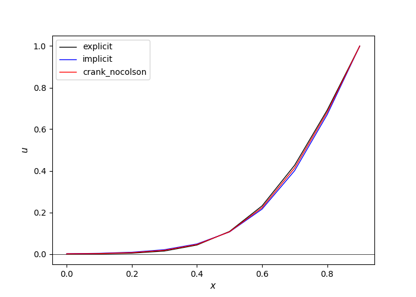

# Differential Equations

## Ordinary differential equations(ODE)
- Runge kutta

## Partial differential equations(PDE)
- Elliptic (B^2-AC < 0)  
Poisson equation    
- Parabolic (B^2-AC = 0)  
Diffusion equation
    - Explicit
    - Implicit
    - Crank-Nicolson  
- Hyperbolic (B^2 - AC > 0)   
Wave equation    

## example
- ODE
~~~
d^2x/dt^2 + adx/dt + bx = 0
~~~

- Poisson equation        

- Diffusion equation  

- Wave equation      

