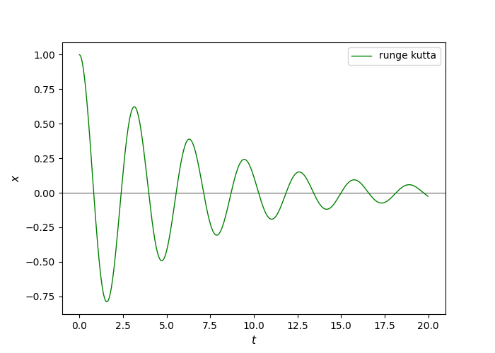
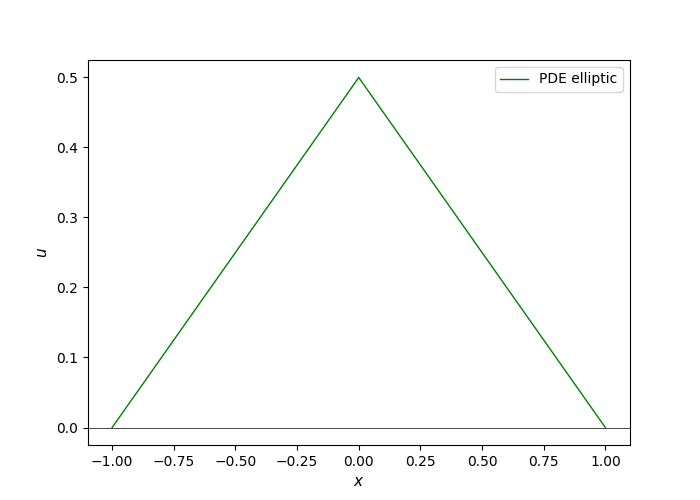
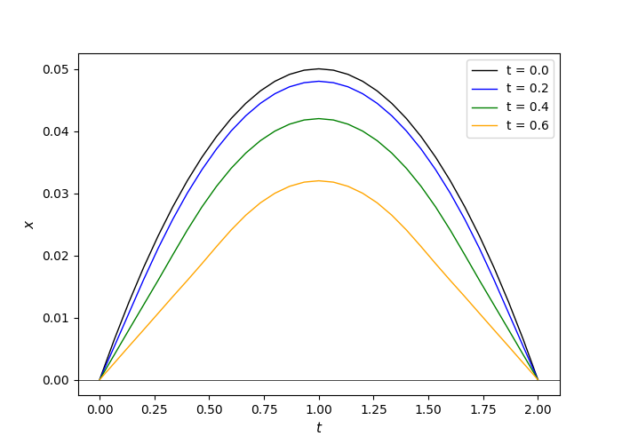

# Differential Equations

## Ordinary differential equations(ODE)
- Runge kutta
~~~
d^2x/dt^2 + adx/dt + bx = 0
~~~

## Partial differential equations(PDE)
- Elliptic (B^2-AC < 0)  
Poisson equation

- Parabolic (B^2-AC = 0)  
Diffusion equation

- Hyperbolic (B^2 - AC > 0)   
Wave equation

