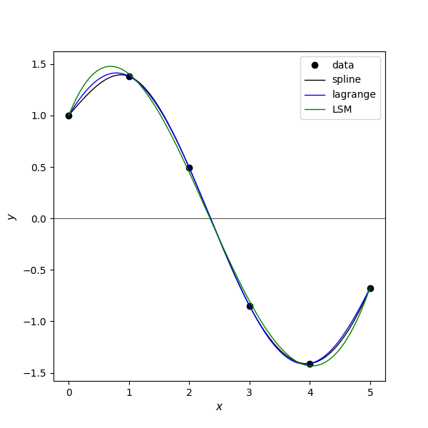

# Interpolation
- Lagrange interpolation `lagrange_interpolation.cpp` 
- Spline interpolation `spline_interpolation.cpp` 
- Least squares `least_squares.cpp`

## example
in01.txt
~~~
0.0 1.0
1.0 1.3817732906760363
2.0 0.4931505902785393
3.0 -0.8488724885405782
4.0 -1.4104461161715403
5.0 -0.6752620891999122
~~~

